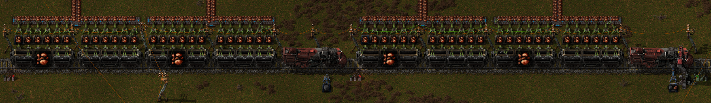

Have you [ever wanted](https://forums.factorio.com/viewtopic.php?t=47763) trains to be loadable when stopped at a signal?
With this mod you can build a multi-train station on a single rail.

Keep in mind that a serial station becomes inefficient as you add more trains, because the trains in the back are stuck until the trains in front of them leave.
Through writing this mod I gained appreciation for the [parallel station](https://wiki.factorio.com/images/Station-example-2.png) design.
